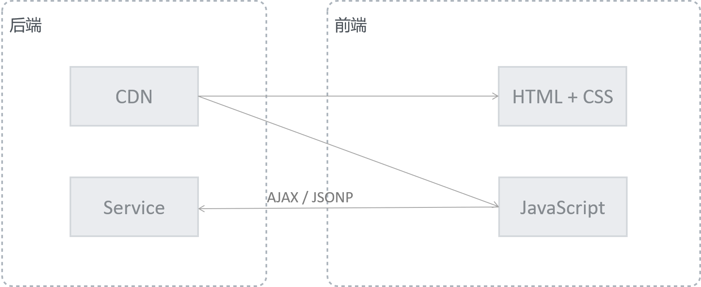
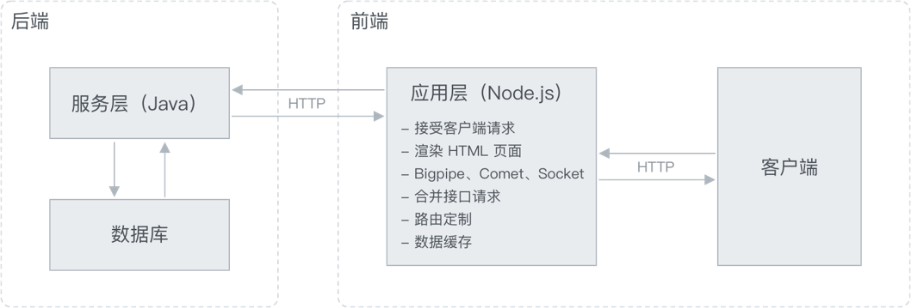

## 纵观 Web 架构

个人认为：当前时代下，应用程序的本质就两点：

1. 将数据友好的呈现给用户
2. 将用户的输入存储到数据之中

在 Web 这一应用环境中核心角色：

- 数据库
- 服务器
- 浏览器

我们以一个带有表单页面的功能为例，其整个流程：

1. 用户通过浏览器（User Agent）发起对服务器（Web Server）的请求
2. 服务器根据用户的请求到数据库中取出相应的数据
3. 将数据结合模板转换为 HTML 代码返回给浏览器
4. 浏览器渲染 HTML，呈现页面给用户
5. 用户在页面（表单）中填写内容
6. 通过浏览器将所填写数据提交到服务器
7. 服务器接收数据，经过整理，保存至数据库

在这样一个相对原始的过程中，有很多事情需要做，粗暴的说也就需要写很多代码。而在以前这个过程中绝大多数的事情都是由后端完成的，可以毫不夸张的说：后端驱动着整个项目。

那前端在干什么？

在这样一种状态下，前端就是给后端「打杂」，没有任何发挥的空间，完全是一个服务于后端的角色。

为什么要变？

答案很简单：

1. 需求在变、用户体验的要求在变，如果一直这样发展下去，后端将不堪重负。
2. 背后的原因更多的是合理性的问题，决定用户看到什么、以何种形式看到应该是前端的工作。

这里我们要讨论的是：这些事情都应该由哪个角色（前端开发人员、后端开发人员）去完成？

## 基于 AJAX 的前后端分离

### 架构方案

### 面临的问题

1. 能力问题（鉴权、缓存、路由定制）
2. 环境问题

## 基于中间层的前后端分离

### 架构方案

[^淘宝前后端分离实践]

### 优势

1. 略微增加成本的情况下给前端更大的发挥空间
2. 完全可控的路由
3. 完全可控的服务端逻辑
4. 接口重组、Bigpipe
5. 服务端渲染、良好的 SEO 支持
6. 后端更为专注，完全从数据出发
7. 不用为特定业务单独提供接口

### 案例：商品列表页实现

1. 用户浏览器对应用服务器（Node.js）发起页面请求
2. 应用服务器接收并校验请求参数（分类 ID、分页页码、排序条件、属性筛选）
3. 应用服务器调用服务层（PHP）提供的数据接口获取对应分类和商品信息数据
4. 应用服务器将所获取的数据通过页面模板渲染为 HTML（服务端渲染）
5. 应用服务器将渲染的结果返回给用户浏览器
6. 浏览器解析并渲染页面
7. 用户进行页面行为操作，比如下一页、按照价格排序等
8. 用户浏览器再次对应用服务器发起 AJAX 请求（JavaScript 实现）
9. 应用服务器接收 AJAX 请求，根据逻辑调用服务接口，将最终组织完成的数据通过 JSON 方式返回
10. 浏览器接收 JSON 数据，通过客户端模板渲染到页面中（客户端渲染）

> P.S.其中 8-10 为客户端 AJAX 调用应用服务器，目的为了增强用户体验，减少服务器压力

## 为什么选 Node.js

1. 几乎没有语言成本
2. 事件驱动、非阻塞

[^淘宝前后端分离实践]: https://2014.jsconfchina.com/slides/herman-taobaoweb/
