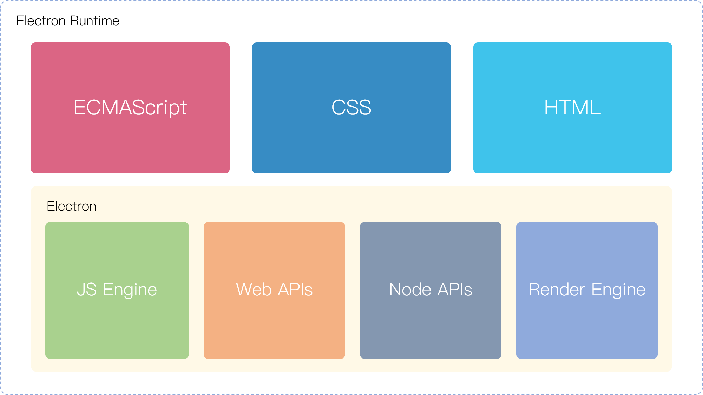
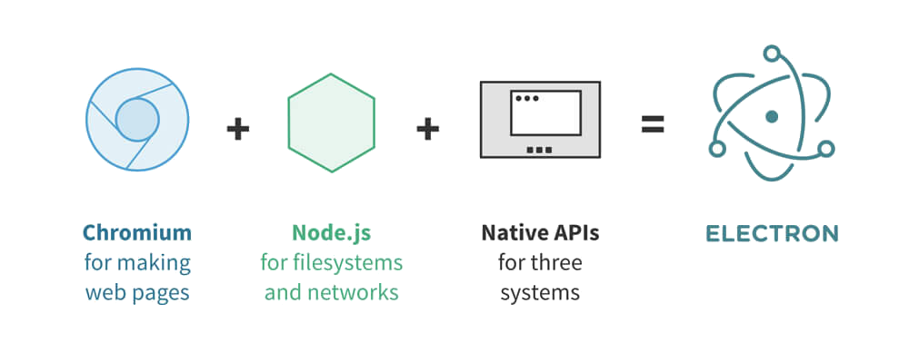
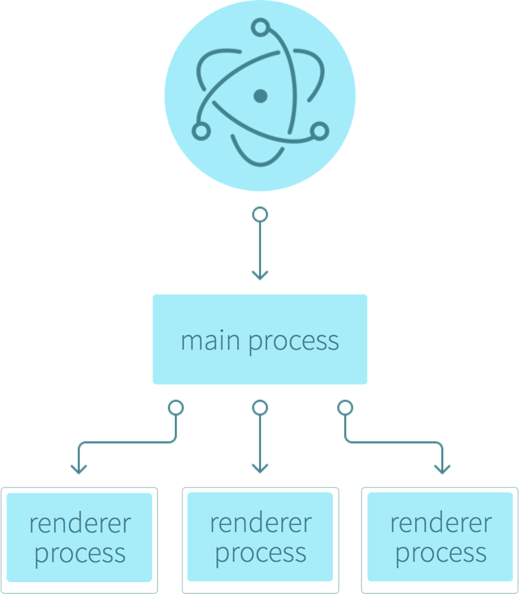

[Electron](https://electronjs.org/) 是一个运行平台，它能够让我们通过 HTML + CSS + JavaScript 开发桌面应用程序。

核心原理就是 Electron 中将 Chromium（Chrome 的内核）和 Node.js 打包到了一起，通过 Chromium 提供 WebView 从而实现 UI 编程能力，通过 Node.js 提供 APIs 从而实现系统接口调用。



简单来说就是，在 Electron 中我们可以像在 Web 开发中一样，通过 HTML + CSS 完成 UI 开发，通过 JavaScript（ECMAScript）调用 APIs 实现业务功能，只不过这里的 APIs = Web APIs + Node APIs。



## 快速上手

一个最基本的 Electron 项目需要有如下的几个必要文件：

```text
your-app/
├── index.html
├── main.js
└── package.json
```

与 Web 所不同的是，这里 Electron 启动的入口是 JavaScript 文件，也就是这里的 `main.js` 文件（简单示例）。

```javascript
// main.js
const { app, BrowserWindow } = require('electron')

app.on('ready', () => {
  // 创建浏览器窗口
  const win = new BrowserWindow({
    width: 800,
    height: 600
  })

  // 加载 index.html 文件
  win.loadFile('index.html')
})
```

在这个 JavaScript 文件中创建页面窗口用于加载所需要在界面上显示的页面文件 `index.html`。更完整的 `main.js` 应该如下：

```javascript
const { app, BrowserWindow } = require('electron')

// 保持对 window 对象的全局引用，如果不这么做的话，
// 当 JavaScript 对象被垃圾回收的时候，
// window 对象对应的窗口将会自动被关闭
let win

const createWindow = () => {
  // 创建浏览器窗口。
  win = new BrowserWindow({
    width: 800,
    height: 600,
    webPreferences: {
      nodeIntegration: true
    }
  })

  // 加载 index.html 文件
  win.loadFile('index.html')

  // 打开开发者工具
  win.webContents.openDevTools()

  // 当 window 被关闭，这个事件会被触发。
  win.on('closed', () => {
    // 取消引用 window 对象，如果你的应用支持多窗口的话，
    // 通常会把多个 window 对象存放在一个数组里面，
    // 与此同时，你应该删除相应的元素。
    win = null
  })
}

// Electron 会在初始化后并准备创建浏览器窗口时，调用这个函数。
// 部分 API 在 ready 事件触发后才能使用。
app.on('ready', createWindow)

// 当全部窗口关闭时退出。
app.on('window-all-closed', () => {
  // 在 macOS 上，除非用户用 Cmd + Q 确定地退出，
  // 否则绝大部分应用及其菜单栏会保持激活。
  if (process.platform !== 'darwin') {
    app.quit()
  }
})

app.on('activate', () => {
  // 在 macOS 上，当单击 dock 图标并且没有其他窗口打开时，
  // 通常在应用程序中重新创建一个窗口。
  if (win === null) {
    createWindow()
  }
})

// 在这个文件中，你可以续写应用剩下主进程代码。
// 也可以拆分成几个文件，然后用 require 导入。
```

`index.html` 中可以是任何你想要呈现的内容。你也可以使用不同的库和框架，这与 Web 中没什么两样，所不同的是，**当你 `BrowserWindow` → `webPreferences` → `nodeIntegration` 设置为 `true` 时，你可以在页面的脚本中使用 Node APIs。**这看起来非常棒，但是要小心使用这个特性，因为如果你加载的不是本地的脚本，那就存在风险。

### 案例：文件编辑器

为了体现 Electron 的能力，我们通过一个简单的记事本应用案例来感受。

克隆基础项目结构代码：

```shell
$ git clone https://github.com/electron/electron-quick-start.git onetext --depth 1
$ cd onetext
$ rm -rf .git
```

安装项目依赖的模块：

```shell
$ yarn # or npm install
```

页面结构与样式：

```html
<!-- index.html -->
<!DOCTYPE html>
<html>
  <head>
    <meta charset="UTF-8" />
    <title>Editor</title>
    <style>
      html,
      body {
        margin: 0;
        width: 100%;
        height: 100%;
        overflow: hidden;
      }

      #editor {
        box-sizing: border-box;
        padding: 3%;
        width: 100%;
        height: 100%;
        border: 1px solid #ddd;
        outline: 0;
        font-size: 14px;
        resize: none;
      }
    </style>
  </head>
  <body>
    <textarea id="editor" autofocus></textarea>
    <script src="./renderer.js"></script>
  </body>
</html>
```

页面脚本文件 `renderer.js`：

```javascript
// renderer.js
const os = require('os')
const fs = require('fs')
const path = require('path')

const editor = document.getElementById('editor')

const filename = path.join(os.homedir(), 'foo.txt')

const save = () => {
  fs.writeFileSync(filename, editor.value)
}

const open = () => {
  editor.value = fs.readFileSync(filename, 'utf8')
}

document.addEventListener('keydown', e => {
  if (e.ctrlKey && e.keyCode === 83) {
    save()
    return false
  }
  if (e.ctrlKey && e.keyCode === 79) {
    open()
    return false
  }
})
```

当然 Electron 模块中提供了更合适的 APIs，用于提示用户保存文件位置、让用户选择打开某个文件：

```javascript
const fs = require('fs')
const { dialog } = require('electron').remote

const editor = document.getElementById('editor')

const save = () => {
  const filename = dialog.showSaveDialogSync()
  filename && fs.writeFileSync(filename, editor.value)
}

const open = () => {
  const result = dialog.showOpenDialogSync({ properties: ['openFile'] })
  if (!result) return
  const filename = result[0]
  editor.value = fs.readFileSync(filename, 'utf8')
}

document.addEventListener('keydown', e => {
  if (e.ctrlKey && e.keyCode === 83) {
    save()
    return false
  }
  if (e.ctrlKey && e.keyCode === 79) {
    open()
    return false
  }
})
```

注意事项：

1. 在渲染进程中使用 Node APIs 需要开启当前 `BrowserWindow` 的 `nodeIntegration`（针对 Electron 5 以上版本）。
2. 由于渲染进程是运行在 Chromium 中的，所以不管是样式还是脚本都不需要考虑兼容其他环境问题，你可以放心大胆的使用新特性。

通过以上的示例，我们应该就可以体会到 Electron 开发的过程，以及 Electron 的内部组成。

## 主进程与渲染进程

Electron 中有两种进程类型，分别为「主进程」和「渲染进程」，它们的职责和能力各不相同：

通过 Electron 直接启动运行的脚本，运行这个脚本的进程被称为「主进程」。 一个 Electron 应用总是有且只有一个主进程。一般我们都会在这个进程中管理整个应用，所以我个人也把它称之为「调度进程」。

通过 `BrowserWindow` 创建的页面窗口运行在单独的进程当中，称之为「渲染进程」。负责展示页面以及运行页面上所需要的脚本。



## With Framework

接下来我们再来了解一下，如何配合使用 React 或者 Vue.js 这样的 UI 框架开发 Electron 应用。

如果你不需要使用 JSX 或者单文件组件这些特性，你可以直接把这些框架当作库，直接在页面中使用。

当然，就现阶段来说，大家很自然的会把这些有特性和框架捆绑，总是用 A 就必须要用 B，所以这里还是需要推荐给大家一个我觉得非常方便的集成环境。

### electron-webpack

[electron-webpack](https://github.com/electron-userland/electron-webpack) 其实是一个通过 webpack 编译 Electron 代码的集成工具，通过简单的配置就可以支持 React 和 Vue.js，当然你也可以让它支持更多。

它要求你有通过特定的项目结构编写代码：

```text
my-project/
├─ src/
│  ├─ main/
│  │  └─ index.js
│  ├─ renderer/
│  │  └─ index.js
│  └─ common/
└─ static/
```

我们可通过官方提供的模板快速创建这样结构的项目：

```shell
$ git clone https://github.com/electron-userland/electron-webpack-quick-start.git my-project --depth 1
$ cd my-project
$ rm -rf .git

# install dependencies
$ yarn # or npm install
```

这个项目中提供了一些有用的 scripts：

```shell
# run application in development mode
yarn dev

# compile source code and create webpack output
yarn compile

# `yarn compile` & create build with electron-builder
yarn dist

# `yarn compile` & create unpacked build with electron-builder
yarn dist:dir
```

### 使用 Vue.js

由于 electron-webpack 中会自动加载 Vue.js 所需的 loader，所以只需要安装对应的模块，Vue.js 单文件组件将自动工作。

```shell
yarn add vue electron-webpack-vue --dev
```

### 使用 React

同理，React 的工作也只需要安装相应的模块：

```shell
yarn add react react-dom @babel/preset-react --dev
```

## 打包和发布

我们可以使用类似 [electron-builder](https://www.electron.build) 的一些集成工具轻松完成跨平台打包任务。

刚刚介绍的 electron-webpack 的初始项目模板中就包含了此工具的使用。

> 我最近在重写一个基于 Vue.js + TypeScript 的 Electron 骨架项目，如需自取：
>
> https://github.com/zce/electron-boilerplate

[^1]: https://medium.com/developers-writing/building-a-desktop-application-with-electron-204203eeb658
