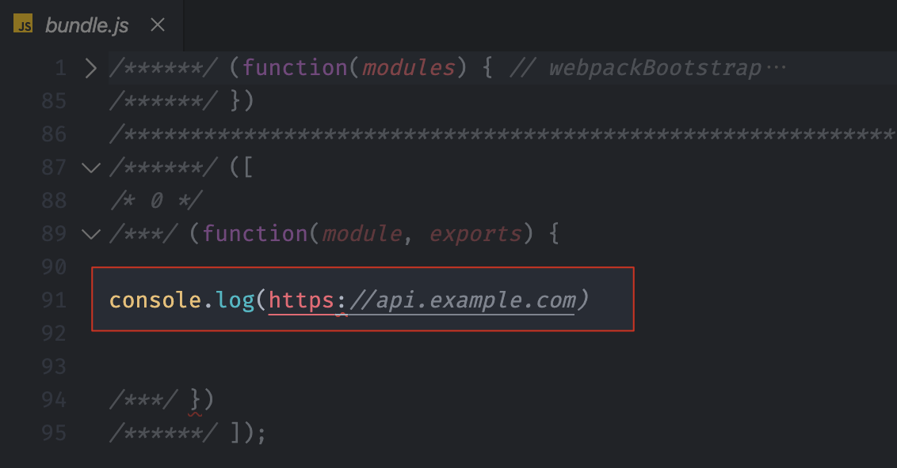
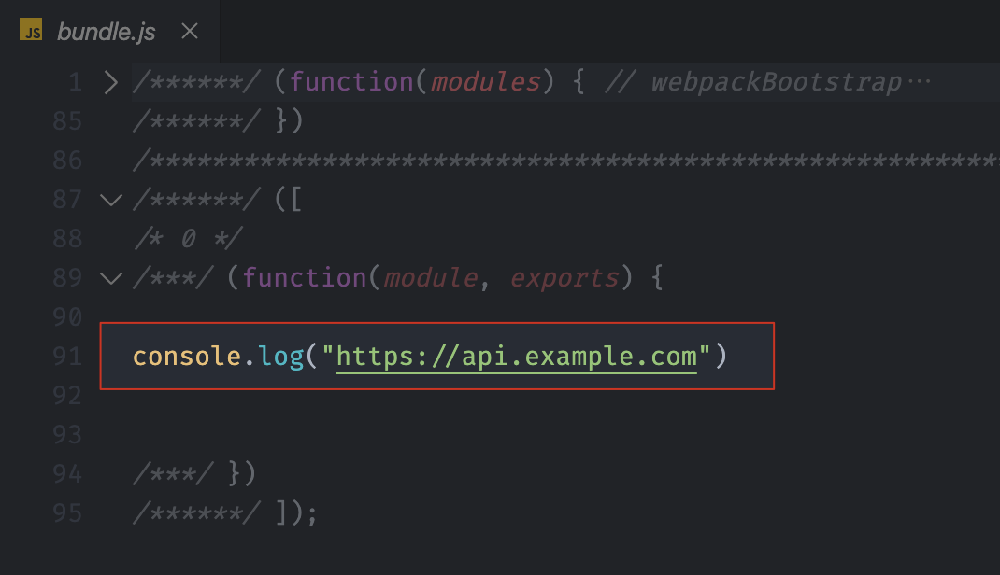
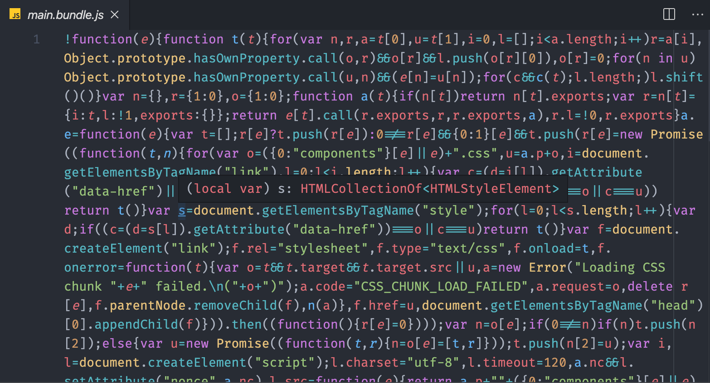
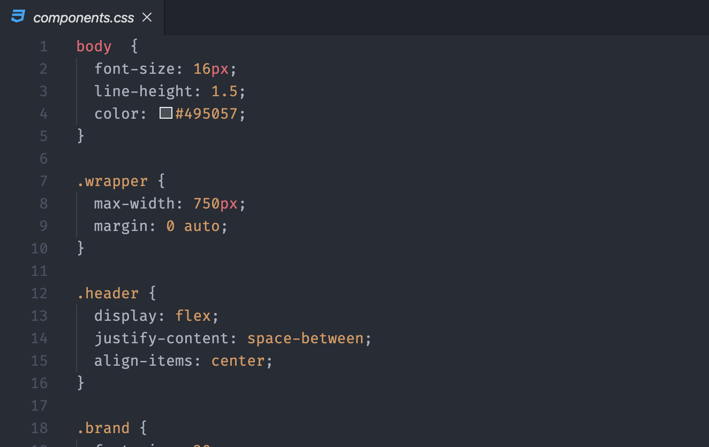
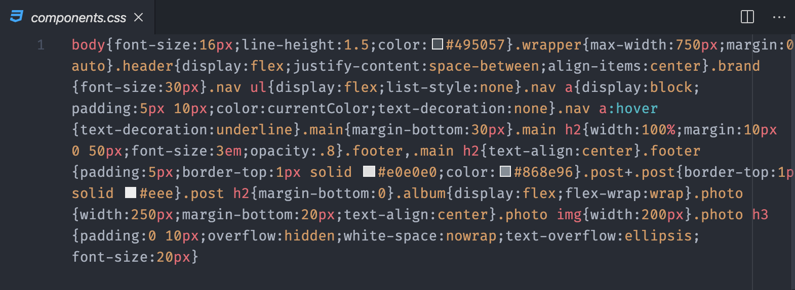
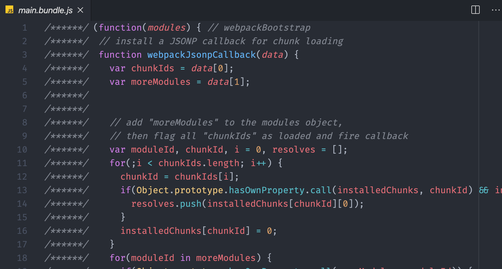

你好，我是汪磊，今天我们要一起探索的是 Webpack 在生产模式打包过程中的一些常用配置和一些的优化插件。

在前面的文章中，我们了解到的一些用法和特性都是为了在开发阶段能够拥有更好的开发体验。而随着这些体验的提升，一个新的问题出现在我们面前：我们的打包结果会变得越来越臃肿。

这是因为在这个过程中 Webpack 为了实现这些特性，会自动往打包结果中添加一些内容。例如我们之前用到的 [Source Map](/2020/04/best-practices-of-webpack-sourcemap/) 和 [HMR](/2020/04/webpack-hot-module-replacement/)，它们都会在输出结果中添加额外代码来实现各自的功能。

但是这些额外的代码对生产环境来说是冗余的。因为生产环境和开发环境有很大的差异，在生产环境中我们强调的是以更少量、更高效的代码完成业务功能，也就是注重运行效率。而开发环境中我们注重的只是开发效率。

那针对这个问题，Webpack 4 推出了 mode 的用法，为我们提供了不同模式下的一些预设配置，其中生产模式下就已经包括了很多优化配置。

同时 Webpack 也建议我们为不同的工作环境创建不同的配置，以便于让我们的打包结果可以适用于不同的环境。

接下来我们一起来探索一下生产环境中的一些优化方式和注意事项。

### 不同环境下的配置

我们先为不同的工作环境创建不同的 Webpack 配置。创建不同环境配置的方式主要有两种：

- 在配置文件中添加相应的判断条件，根据环境不同导出不同配置。
- 为不同环境单独添加一个配置文件，一个环境对应一个配置文件。

我们分别尝试一下通过这两种方式，为开发环境和生产环境创建不同配置。

首先我们来看在配置文件中添加判断的方式。我们回到配置文件中，Webpack 配置文件还支持导出一个函数，然后在函数中返回所需要的配置对象。这个函数可以接收两个参数，第一个是 `env`，是我们通过 CLI 传递的环境名参数，第二个是 `argv`，是运行 CLI 过程中的所有参数。具体代码如下：

```javascript
// ./webpack.config.js
module.exports = (env, argv) => {
  return {
    // ... webpack 配置
  }
}
```

那我们就可以借助这个特点，为开发环境和生产环境创建不同配置。我先将不同模式下公共的配置定义为一个 config 对象，具体代码如下：

```javascript
// ./webpack.config.js
module.exports = (env, argv) => {
  const config = {
    // ... 不同模式下的公共配置
  }
  return config
}
```

然后通过判断，再为 `config` 对象添加不同环境下的特殊配置。具体如下：

```javascript
// ./webpack.config.js
module.exports = (env, argv) => {
  const config = {
    // ... 不同模式下的公共配置
  }

  if (env === 'development') {
    // 为 config 添加开发模式下的特殊配置
    config.mode = 'development'
    config.devtool = 'cheap-eval-module-source-map'
  } else if (env === 'production') {
    // 为 config 添加生产模式下的特殊配置
    config.mode = 'production'
    config.devtool = 'nosources-source-map'
  }

  return config
}
```

例如这里，我们判断 `env` 等于 `'development'`（开发模式）的时候，我们将 mode 设置为 `'development'`，将 `devtool` 设置为 `'cheap-eval-module-source-map'`；而当 `env` 等于 `'production'`（生产模式）时，我们又将 `mode` 和 `devtool` 设置为生产模式下需要的值。

当然，你还可以分别为不同模式设置其他不同的属性、插件，这也都是类似的。

通过这种方式完成配置过后，我们打开命令行终端，这里我们再去执行 webpack 命令时就可以通过 `--env` 参数去指定具体的环境名称，从而实现在不同环境中使用不同的配置。

那这就是通过在 Webpack 配置文件导出的函数中对环境进行判断，从而实现不同环境对应不同配置。这种方式是 Webpack 建议的方式。

你也可以直接定义环境变量，然后在全局判断环境变量，根据环境变量的不同导出不同配置。这种方式也是类似的，这里我们就不做过多介绍了。

#### 不同环境的配置文件

通过判断环境名参数返回不同配置对象的方式只适用于中小型项目，因为一旦项目变得复杂，我们的配置也会一起变得复杂起来。所以对于大型的项目来说，还是建议使用不同环境对应不同配置文件的方式来实现。

一般在这种方式下，项目中最少会有三个 webpack 的配置文件。其中两个用来分别适配开发环境和生产环境，另外一个则是公共配置。因为开发环境和生产环境的配置并不是完全不同的，所以需要一个公共文件来抽象两者相同的配置。具体配置文件结构如下：

```diff
.
├── webpack.common.js ···························· 公共配置
├── webpack.dev.js ······························· 开发模式配置
└── webpack.prod.js ······························ 生产模式配置
```

首先我们在项目根目录下新建一个 webpack.common.js，在这个文件中导出不同模式下的公共配置；然后再来创建一个 webpack.dev.js 和一个 webpack.prod.js 分别定义开发和生产环境特殊的配置。

在不同环境的具体配置中我们先导入公共配置对象，然后这里可以使用 `Object.assign()` 方法把公共配置对象复制到具体环境的配置对象中，并且同时去覆盖其中的一些配置。具体如下：

```javascript
// ./webpack.common.js
module.exports = {
  // ... 公共配置
}

// ./webpack.prod.js
const common = require('./webpack.common')
module.exports = Object.assign(common, {
  // 生产模式配置
})

// ./webpack.dev.js
const common = require('./webpack.common')
module.exports = Object.assign(common, {
  // 开发模式配置
})
```

如果你熟悉 `Object.assign()` 方法，就应该知道，这个方法会完全覆盖掉前一个对象中的同名属性。这个特点对于普通值类型属性的覆盖都没有什么问题。但是像配置中的 `plugins` 这种数组，我们只是希望在原有公共配置的插件基础上添加一些插件，那 `Object.assign()` 就做不到了。

所以我们需要更合适的方法来合并这里的配置与公共的配置。你可以使用 [Lodash](http://lodash.com) 提供的 `merge` 函数来实现，不过社区中提供了更为专业的模块 [webpack-merge](https://github.com/survivejs/webpack-merge)，它专门用来满足我们这里合并 Webpack 配置的需求。

我们可以先通过 npm 安装一下 webpack-merge 模块。具体命令如下：

```shell
$ npm i webpack-merge --save-dev
# or yarn add webpack-merge --dev
```

安装完成过后我们回到配置文件中，这里先载入这个模块。那这个模块导出的就是一个 `merge` 函数，我们使用这个函数来合并我们这里的配置与公共的配置。具体代码如下：

```javascript
// ./webpack.common.js
module.exports = {
  // ... 公共配置
}

// ./webpack.prod.js
const merge = require('webpack-merge')
const common = require('./webpack.common')
module.exports = merge(common, {
  // 生产模式配置
})

// ./webpack.dev.jss
const merge = require('webpack-merge')
const common = require('./webpack.common')
module.exports = merge(common, {
  // 开发模式配置
})
```

使用 webpack-merge 过后，我们这里的配置对象就可以跟普通的 webpack 配置一样，需要什么就配置什么，merge 函数内部会自动处理合并的逻辑。

分别配置完成过后，我们再次回到命令行终端，然后尝试运行 webpack 打包。不过因为这里已经没有默认的配置文件了，所以我们需要通过 `--config` 参数来指定我们所使用的配置文件路径。例如：

```javascript
$ webpack --config webpack.prod.js
```

当然，如果你觉得这样操作让我们的命令变得更复杂了。那你也可以把这个构建命令定义到 npm scripts 中，方便使用。

### 生产模式下的优化插件

在 Webpack 4 中新增的 production 模式下，内部就自动开启了很多通用的优化功能。对于使用者而言，开箱即用是非常方便的，但是对于学习者而言，这种开箱即用会导致我们忽略掉很多需要了解的东西。以至于出现问题无从下手。

如果你想要深入了解 Webpack 的使用，我建议你去单独研究每一个配置背后的作用。这里我们先一起学习 production 模式下几个主要的优化功能，顺便了解一下 Webpack 如何优化打包结果。

#### Define Plugin

首先是 DefinePlugin，DefinePlugin 是用来为我们代码中注入全局成员的。在 production 模式下，默认通过这个插件往代码中注入了一个 `process.env.NODE_ENV`。很多第三方模块都是通过这个成员去判断运行环境，从而决定是否执行例如打印日志之类的操作。

这里我们来单独使用一下这个插件。我们回到配置文件中，DefinePlugin 是一个内置的插件，所以我们先导入 webpack 模块，然后再到 `plugins` 中添加这个插件。这个插件的构造函数接收一个对象参数，对象中的成员都可以被注入到代码中。具体代码如下：

```javascript
// ./webpack.config.js
const webpack = require('webpack')

module.exports = {
/  // ... 其他配置
  plugins: [
    new webpack.DefinePlugin({
      API_BASE_URL: 'https://api.example.com'
    })
  ]
}
```

例如我们这里通过 DefinePlugin 定义一个 `API_BASE_URL` 变量，用来为我们的代码注入 API 服务地址，它的值是一个字符串。

然后我们回到代码中打印这个 `API_BASE_URL`。具体代码如下：

```javascript
// ./src/main.js
console.log(API_BASE_URL)
```

完成以后我们打开控制台，然后运行 webpack 打包。打包完成过后我们找到打包的结果，然后找到 main.js 对应的模块。具体结果如下：



这里我们发现 DefinePlugin 其实就是把我们配置的字符串内容直接替换到了代码中，而目前这个字符串的内容为 `https://api.example.com`，字符串中并没有包含引号，所以替换进来语法自然有问题。

正确的做法是传入一个字符串字面量语句。具体实现如下：

```javascript
// ./webpack.config.js
const webpack = require('webpack')

module.exports = {
  // ... 其他配置
  plugins: [
    new webpack.DefinePlugin({
      // 值要求的是一个代码片段
      API_BASE_URL: '"https://api.example.com"'
    })
  ]
}
```

这样代码内的 `API_BASE_URL` 就会被替换为 `'https://api.example.com'`。具体结果如下：



另外，这里有一个非常常用的小技巧，如果我们需要注入的是一个值，就可以通过 `JSON.stringify()` 的方式来得到表示这个值的字面量。这样就不容易出错了。具体实现如下：

```javascript
// ./webpack.config.js
const webpack = require('webpack')

module.exports = {
  // ... 其他配置
  plugins: [
    new webpack.DefinePlugin({
      // 值要求的是一个代码片段
      API_BASE_URL: JSON.stringify('https://api.example.com')
    })
  ]
}
```

DefinePlugin 的作用虽然简单，但是却非常有用，我们可以用它在代码中注入一些可能变化的值。

#### Mini CSS Extract Plugin

对于 CSS 文件的打包，一般我们会使用 style-loader 进行处理，这种处理方式最终的打包结果就是 CSS 代码会内嵌到 JS 代码中。

mini-css-extract-plugin 是一个可以将 CSS 代码从打包结果中提取出来的插件，

它的使用也非常简单，同样也需要先通过 npm 安装一下这个插件。具体命令如下：

```javascript
$ npm i mini-css-extract-plugin --save-dev
```

安装完成过后，我们回到 Webpack 的配置文件。具体配置如下：

```javascript
// ./webpack.config.js
const MiniCssExtractPlugin = require('mini-css-extract-plugin')

module.exports = {
  mode: 'none',
  entry: {
    main: './src/index.js'
  },
  output: {
    filename: '[name].bundle.js'
  },
  module: {
    rules: [
      {
        test: /\.css$/,
        use: [
          // 'style-loader', // 将样式通过 style 标签注入
          MiniCssExtractPlugin.loader,
          'css-loader'
        ]
      }
    ]
  },
  plugins: [new MiniCssExtractPlugin()]
}
```

我们这里先导入这个插件模块，导入过后我们就可以将这个插件添加到配置对象的 `plugins` 数组中了。这样 Mini CSS Extract Plugin 在工作时就会自动提取代码中的 CSS 了。

除此以外，Mini CSS Extract Plugin 还需要我们使用 MiniCssExtractPlugin 中提供的 loader 去替换掉 style-loader，以此来捕获到所有的样式。

这样的话，打包过后，样式就会存放在独立的文件中，直接通过 `link` 标签引入页面。

不过这里需要注意的是，如果你的 CSS 体积不是很大的话，提取到单个文件中，效果可能适得其反，因为单独的文件就需要单独请求一次。个人经验是如果 CSS 超过 200KB 才需要考虑是否提取出来，作为单独的文件。

#### Optimize CSS Assets Webpack Plugin

使用了 Mini CSS Extract Plugin 过后，样式就被提取到单独的 CSS 文件中了。但是这里同样有一个小问题。

我们回到命令行，这里我们以生产模式运行打包。那按照之前的了解，生产模式下会自动压缩输出的结果，我们可以打开打包生成的 JS 文件。具体结果如下：



然后我们再打开输出的样式文件。具体结果如下：



这里我们发现 JavaScript 文件正常被压缩了，而样式文件并没有被压缩。

这是因为，Webpack 内置的压缩插件仅仅是针对 JS 文件的压缩，其他资源文件的压缩都需要额外的插件。

Webpack 官方推荐了一个 [Optimize CSS Assets Webpack Plugin](https://www.npmjs.com/package/optimize-css-assets-webpack-plugin) 插件。我们可以使用这个插件来压缩我们的样式文件。

我们回到命令行，先来安装这个插件，具体命令如下：

```shell
$ npm i optimize-css-assets-webpack-plugin --save-dev
```

安装完成过后，我们回到配置文件中，添加对应的配置。具体代码如下：

```javascript
// ./webpack.config.js
const MiniCssExtractPlugin = require('mini-css-extract-plugin')
const OptimizeCssAssetsWebpackPlugin = require('optimize-css-assets-webpack-plugin')

module.exports = {
  mode: 'none',
  entry: {
    main: './src/index.js'
  },
  output: {
    filename: '[name].bundle.js'
  },
  module: {
    rules: [
      {
        test: /\.css$/,
        use: [MiniCssExtractPlugin.loader, 'css-loader']
      }
    ]
  },
  plugins: [new MiniCssExtractPlugin(), new OptimizeCssAssetsWebpackPlugin()]
}
```

这里同样先导入这个插件，导入完成以后我们把这个插件添加到 `plugins` 数组中。

那此时我们再次回到命令行运行打包。

打包完成过后，我们的样式文件就会以压缩格式输出了。具体结果如下：



不过这里还有个额外的小点，可能你会在这个插件的官方文档中发现，文档中的这个插件并不是配置在 `plugins` 数组中的，而是添加到了 `optimization` 对象中的 `minimizer` 属性中。具体如下：

```javascript
// ./webpack.config.js
const MiniCssExtractPlugin = require('mini-css-extract-plugin')
const OptimizeCssAssetsWebpackPlugin = require('optimize-css-assets-webpack-plugin')

module.exports = {
  mode: 'none',
  entry: {
    main: './src/index.js'
  },
  output: {
    filename: '[name].bundle.js'
  },
  optimization: {
    minimizer: [new OptimizeCssAssetsWebpackPlugin()]
  },
  module: {
    rules: [
      {
        test: /\.css$/,
        use: [MiniCssExtractPlugin.loader, 'css-loader']
      }
    ]
  },
  plugins: [new MiniCssExtractPlugin()]
}
```

那这是为什么呢？

其实也很简单，如果我们配置到 `plugins` 属性中，那么这个插件在任何情况下都会工作。而配置到 `minimizer` 中，就只会在 minimize 特性开启时才工作。

所以 Webpack 建议像这种压缩插件，应该我们配置到 `minimizer` 中，便于 `minimize` 选项的统一控制。

但是这么配置也有个缺点，此时我们再次运行生产模式打包，打包完成后再来看一眼输出的 JS 文件，此时你会发现，原本可以自动压缩的 JS，现在却不能压缩了。具体 JS 的输出结果如下：



那这是因为我们设置了 minimizer，Webpack 认为我们需要使用自定义压缩器插件，那内部的 JS 压缩器就会被覆盖掉。我们必须手动再添加回来。

内置的 JS 压缩插件叫作 terser-webpack-plugin，我们回到命令行手动安装一下这个模块。

```shell
$ npm i terser-webpack-plugin --save-dev
```

安装完成过后，这里我们再手动添加这个模块到 `minimizer` 配置当中。具体代码如下：

```javascript
// ./webpack.config.js
const MiniCssExtractPlugin = require('mini-css-extract-plugin')
const OptimizeCssAssetsWebpackPlugin = require('optimize-css-assets-webpack-plugin')
const TerserWebpackPlugin = require('terser-webpack-plugin')

module.exports = {
  mode: 'none',
  entry: {
    main: './src/index.js'
  },
  output: {
    filename: '[name].bundle.js'
  },
  optimization: {
    minimizer: [new TerserWebpackPlugin(), new OptimizeCssAssetsWebpackPlugin()]
  },
  module: {
    rules: [
      {
        test: /\.css$/,
        use: [MiniCssExtractPlugin.loader, 'css-loader']
      }
    ]
  },
  plugins: [new MiniCssExtractPlugin()]
}
```

那这样的话，我们再次以生产模式运行打包，JS 文件和 CSS 文件就都可以正常压缩了。

### 写在最后

最后再来简单总结一下，今天我们介绍了如何为 Webpack 添加不同环境下的不同配置，以及在生产模式打包时我们经常用到的几个插件。

这当中需要你理解的地方并没有太多，更多的是了解这些插件的具体作用和使用方法。除此之外，你也需要更多地了解社区当中其他的常用插件。

以上就是今天全部的内容，我是汪磊，我们下期再见 👋

> Photo by [Austin Distel](https://unsplash.com/@austindistel) on [Unsplash](https://unsplash.com)
